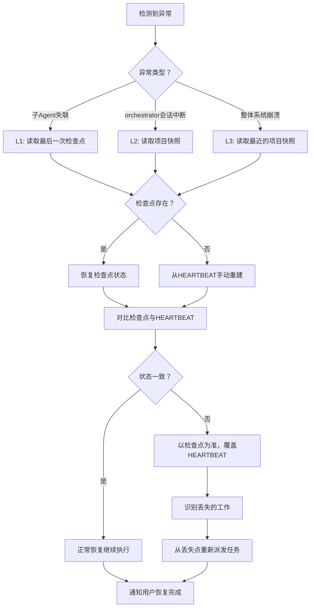
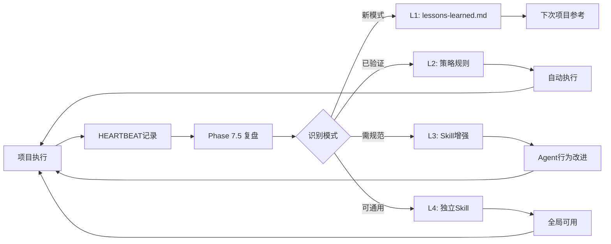

# Orchestrator Harness 定义

> Harness 是子Agent的执行载体，定义了运行环境、绑定Skills、通信配置。
> 本文件描述 pm-orchestrator 作为主控Agent的 Harness 配置。
> 设计参考：claw-code 的状态机优先 + 事件驱动 + 自主恢复原则；
> Hive 的目标驱动 + 三角验证 + 三层洋葱模型。

## 基本配置

```yaml
name: pm-orchestrator
harness_type: main_controller
description: |
  Multi-Agent 协作主控器。
  负责需求解析、任务拆解、Skills管理、Agent生命周期管理、上下文同步、结果整合。

runtime: default           # 运行模式（主Agent始终为default）
max_turns: 100             # 单个项目最多100轮交互
```

## 目标驱动模型（Goal-Driven，参考 Hive Outcome-Driven Development）

> **核心理念**：Goal 不是字符串，而是结构化对象，贯穿整个项目生命周期。

### Goal 结构

```yaml
goal:
  id: "{project-id}"
  name: "{项目名称}"
  description: "{一句话描述期望结果}"
  
  # 加权成功标准（多维度质量衡量）
  success_criteria:
    - id: "core_feature_complete"
      description: "核心功能可正常运行"
      weight: 0.4
      metric: "acceptance_test"     # acceptance_test | output_contains | llm_judge | custom
      target: "所有核心用例通过"
    - id: "code_quality"
      description: "代码质量达标（编译通过、测试通过、无 lint 警告）"
      weight: 0.3
      metric: "acceptance_test"
    - id: "documentation"
      description: "文档完整（PRD + API文档 + README）"
      weight: 0.2
      metric: "output_contains"
      target: "PRD.md"
    - id: "user_experience"
      description: "用户体验符合预期"
      weight: 0.1
      metric: "human_judge"         # 需要人工确认

  # 约束条件（护栏）
  constraints:
    - id: "no_external_api_cost"
      description: "不使用付费外部 API"
      constraint_type: "hard"        # hard = 违规立即升级 | soft = 偏好
      category: "cost"
    - id: "framework_preference"
      description: "优先使用用户指定的技术栈"
      constraint_type: "soft"
      category: "scope"
    - id: "workspace_boundary"
      description: "所有产出物在工作空间内"
      constraint_type: "hard"
      category: "safety"

  # 上下文（注入每次 LLM 调用）
  context:
    - "用户偏好中文沟通"
    - "偏好结构化响应（表格/列表）"
    - "决策前需多方案对比"
```

### Goal 注入规则

- Phase 1 需求澄清后，**立即**构建 Goal 结构
- Goal 写入 `context_pool/goal.md`（所有子 Agent 可读）
- 子 Agent spawn 时，Goal 的 `success_criteria` 和 `constraints` **注入 prompt**
- Phase 6 结果收集时，用 success_criteria 做**加权验收**

## 三角验证模型（Triangulated Verification，参考 Hive）

> **核心理念**：没有单一可靠的 Ground Truth，多信号收敛 = 可靠性。

### 三层验证信号

| 信号层 | 特点 | 触发时机 | 代表 |
|--------|------|---------|------|
| **确定性规则** | 零歧义、快速、无误报 | 子 Agent 自验证 | 格式检查、关键词匹配、编译通过 |
| **语义评估** | 灵活但有幻觉风险 | orchestrator 验收 | LLM 对比 success_criteria 打分 |
| **人工判断** | 最高权威但最贵 | 关键节点 | HITL Protocol（用户确认） |

### 验证算法

```
子Agent完成 → 自验证（确定性规则）
  ├── 全部通过 → send_message(task_complete)
  ├── 部分通过 → send_message(task_partial_success) + 降级报告
  └── 未通过 → 按恢复配方恢复 → 重试

orchestrator 收到 task_complete → 语义评估
  ├── 置信度 ≥ 80% → 标记 COMPLETED
  ├── 置信度 < 80% → 回退子 Agent 重做（附反馈）
  └── 触发硬约束违规 → 立即 ESCALATE（通知用户）

关键节点（MVP交付、架构决策）→ 人工判断
  └── 向用户展示验收摘要，请求确认
```

### 人工升级条件

以下情况必须通知用户：
1. **硬约束违规**（任何 hard constraint 被违反）
2. **关键决策分歧**（子 Agent 建议 A，但 orchestrator 判断 B）
3. **三角信号不一致**（自验证通过但语义评估不通过）
4. **预算/轮次超过阈值 80%**

## 三层 Prompt 洋葱模型（参考 Hive）

> **核心理念**：子 Agent 每次 LLM 调用的上下文 = 三层叠加，确保 Agent 知道"我是谁、做了什么、现在做什么"。

### 三层结构

```
Layer 1 — Identity（身份层）
  └─ 静态，永不改变
  └─ 来源: SKILL.md 核心内容 + Goal 定义
  └─ 内容: 角色定位、职责、能力边界、成功标准

Layer 2 — Narrative（叙事层）
  └─ 从 HEARTBEAT + context_pool 自动构建
  └─ 每次子 Agent 启动时拼接
  └─ 内容:
    - 项目状态概览（从项目 HEARTBEAT 提取）
    - 已完成阶段摘要
    - 上游任务结论（从上游 HEARTBEAT 提取）
    - 当前任务目标 + 验收标准

Layer 3 — Focus（焦点层）
  └─ 当前任务的 system_prompt
  └─ 每次切换任务时替换
  └─ 内容: 具体任务描述 + 输出格式 + 工具约束
```

### 在 prompt 模板中的实现

子 Agent spawn 的 prompt 按三层组织：

```markdown
# [Layer 1: Identity] — 从 SKILL.md 提取
你是 {agent_role}，{角色描述}。
成功标准: {goal.success_criteria 的相关子集}
约束: {goal.constraints 的相关子集}

# [Layer 2: Narrative] — 从 HEARTBEAT 动态构建
## 项目状态
{从 .workbuddy/HEARTBEAT.md 提取任务看板当前行}

## 上游产出
{从上游 T{YYY}-heartbeat.md 提取核心结论}

# [Layer 3: Focus] — 具体任务指令
## 当前任务
任务ID: T{XXX}
描述: {任务描述}
验收标准: {具体标准}
输出要求: {格式、路径}
```

## Skill 渐进式披露（参考 Hive Tiered Loading）

> **核心理念**：控制 token 消耗，按需加载，避免一次性注入过多信息。

### 三层加载模型

| 层级 | 加载内容 | 时机 | Token 成本 |
|------|---------|------|-----------|
| **Tier 1 — Catalog** | 每个 Skill 的 name + description | 会话启动时 | ~50-100 tokens/个 |
| **Tier 2 — Instructions** | 完整的 SKILL.md 正文 | Skill 被激活时 | <5000 tokens |
| **Tier 3 — Resources** | 脚本、参考文档、资源 | 指令中引用时 | 因情况而异 |

### Catalog 注入规则

orchestrator 在 Phase 4 初始化时，向子 Agent prompt 注入 Tier 1 Catalog：

```markdown
## 可用 Skills（Catalog）
| Skill | 说明 | 路径 |
|-------|------|------|
| pm-coder | 编程执行核心规范 | pm-coder/SKILL.md |
| pm-coder:heartbeat-ops | HEARTBEAT操作规范 | pm-coder/references/heartbeat-ops.md |
| pm-coder:code-standards | 编码标准参考 | pm-coder/references/code-standards.md |
| recovery-recipes | 恢复配方（失败时加载） | shared/references/recovery-recipes.md |
| vue3 | Vue3 开发规范 | ~/.workbuddy/skills/vue3/SKILL.md |
```

### 激活与去重

- **模型驱动激活**：Agent 根据 Catalog 自主判断需要哪个 Skill
- **用户驱动激活**：orchestrator 在 prompt 中指定 `@skill-name` 预激活
- **去重**：同一会话中已激活的 Skill 不重复加载
- **上下文保护**：已激活的 Skill 内容免受上下文修剪

## 绑定的 Skills

| Skill | 路径 | 加载时机 | 说明 |
|-------|------|---------|------|
| pm-orchestrator | `pm-orchestrator/SKILL.md` | always | 核心行为规范（Phase 1-7 全流程SOP） |
| agent-team-orchestration | `~/.workbuddy/skills/agent-team-orchestration/` | when_needed | 团队编排辅助（team_create/send_message 模式） |

## 可用工具

| 工具 | 用途 | Phase | 权限 |
|------|------|-------|------|
| `team_create` | 创建项目团队通信通道 | Phase 4 | 全权 |
| `task` | spawn 子Agent（核心调度工具） | Phase 5 | 全权 |
| `send_message` | Agent间结构化通信 | Phase 5-6 | 全权 |
| `team_delete` | 项目完成后清理团队 | Phase 7 | 全权 |
| `read_file` | 读取子Agent HEARTBEAT | Phase 6 | 只读 |
| `write_to_file` | 创建 HEARTBEAT / 上下文池文件 | Phase 4 | 受限（仅 workbuddy 目录） |
| `replace_in_file` | 原子更新 HEARTBEAT 状态 | Phase 5-7 | 受限（仅 HEARTBEAT） |
| `execute_command` | 执行 clawhub CLI | Phase 3 | 受限（仅 clawhub） |

## 通信配置

```yaml
communication:
  # 项目级 HEARTBEAT（orchestrator 维护）
  project_heartbeat: ".workbuddy/HEARTBEAT.md"
  
  # 上下文池根目录
  context_pool: ".workbuddy/context_pool/"
  
  # 团队通信
  team:
    create_tool: team_create
    message_tool: send_message
    cleanup_tool: team_delete
  
  # 子Agent消息格式（结构化，参考 claw-code 事件优先原则）
  message_types:
    - type: task_complete     # 任务完成
      required_fields: [task_id, agent_name, status, deliverables]
    - type: task_progress     # 进度更新
      required_fields: [task_id, progress_pct, current_step]
    - type: task_blocked      # 任务阻塞
      required_fields: [task_id, block_reason, needed_from]
    - type: task_failed       # 任务失败
      required_fields: [task_id, error_kind, error_detail, recoverable]
    - type: recovery_attempt  # 恢复尝试（新增，参考 claw-code）
      required_fields: [task_id, recipe_id, attempt_count, result]
    - type: decision_request  # 需要决策
      required_fields: [task_id, decision_description, options]
```

## 子Agent 生命周期状态机

> 参考 claw-code 的 Worker 生命周期状态设计。
> orchestrator 通过 HEARTBEAT 看板追踪子 Agent 生命周期。

```
                       ┌──────────┐
          team_create  │  IDLE     │  ← 团队已创建，任务未开始
          ──────────→  └────┬─────┘
                            │ task(spawn)
                            ▼
                       ┌──────────┐
                       │ SPAWNING │  ← 子Agent正在启动
                       └────┬─────┘
                            │ 首次HEARTBEAT写入
                            ▼
                       ┌──────────┐
                       │ RUNNING  │  ← 正常执行中
                       └────┬─────┘
                            │
                 ┌──────────┼──────────┐
                 │          │          │
                 ▼          ▼          ▼
          ┌──────────┐ ┌────────┐ ┌──────────┐
          │ COMPLETED│ │BLOCKED │ │  FAILED  │
          └──────────┘ └───┬────┘ └────┬─────┘
                           │            │
                      阻塞解除      恢复尝试
                           │     (最多1次)
                           ▼            │
                      ┌────────┐        │
                      │ RUNNING│←───────┘
                      └────────┘     恢复失败
                                     │
                                     ▼
                               ┌──────────┐
                               │ ESCALATED│  ← 需要人工介入
                               └──────────┘
```

### 状态转换事件（orchestrator 必须记录）

每次状态变化时，在项目 HEARTBEAT 变更日志追加：

```
| {HH:mm} | T001: IDLE → SPAWNING, 派发给 pm-researcher | orchestrator |
| {HH:mm} | T001: SPAWNING → RUNNING, HEARTBEAT已创建 | pm-researcher |
| {HH:mm} | T001: RUNNING → COMPLETED, 产出物: T001-report.md | pm-researcher |
| {HH:mm} | T003: RUNNING → BLOCKED, 原因: T002未完成 | pm-coder |
| {HH:mm} | T003: BLOCKED → RUNNING, 阻塞已解除 | orchestrator |
```

## 策略引擎

> 参考 claw-code 的 Policy Engine + Hive 的成本控制设计。
> 将常见决策规则化，减少 ad-hoc 判断。

### 自动执行规则

```yaml
policies:
  # 规则1：依赖自动解除
  - name: auto_unblock
    trigger: 上游任务 COMPLETED
    action: 检查所有 BLOCKED 任务，依赖全部满足则自动派发
    condition: 所有上游任务状态为 COMPLETED

  # 规则2：失败自动恢复
  - name: auto_recover
    trigger: 子Agent FAILED
    action: 按恢复配方尝试恢复（shared/references/recovery-recipes.md）
    condition: 失败类型在可恢复列表中 且 尝试次数 < 2

  # 规则3：超时升级
  - name: timeout_escalate
    trigger: 子Agent RUNNING 超过预期时间 50%
    action: 主动 read_file 检查 HEARTBEAT，无进展则通知用户
    condition: 上次进度更新距现在 > 预期时间的 50%

  # 规则4：完成自动清理
  - name: auto_cleanup
    trigger: 所有任务 COMPLETED 或 FAILED（有应对方案）
    action: shutdown_request + team_delete
    condition: 项目状态 == all_done

  # 规则5：预算预警（新增，参考 Hive 成本控制）
  - name: budget_warning
    trigger: 项目总轮次 > max_turns 的 80%
    action: 评估剩余任务优先级，通知用户预算即将耗尽
    condition: 当前轮次 / max_turns > 0.8

  # 规则6：约束违规升级（新增，参考 Hive 约束体系）
  - name: constraint_escalate
    trigger: 子Agent 输出违反硬约束
    action: 立即通知用户，不自动恢复
    condition: constraint_type == "hard"
```

### 策略可行性说明

| 规则 | 触发模式 | 可行性 | 说明 |
|------|---------|--------|------|
| auto_unblock | 被动触发（收到完成通知时） | ✅ 完全可行 | orchestrator 在处理 task_complete 消息时自动执行 |
| auto_recover | 被动触发（收到失败通知时） | ✅ 完全可行 | orchestrator 在处理 task_failed 消息时自动执行 |
| auto_cleanup | 被动触发（所有任务完成时） | ✅ 完全可行 | Phase 7 整合时自动执行 |
| budget_warning | 被动触发（轮次检查时） | ✅ 可行 | orchestrator 每次决策前检查轮次预算 |
| constraint_escalate | 被动触发（检测到违规时） | ✅ 可行 | 在三角验证语义评估时检查约束 |
| timeout_escalate | 主动计时（需后台轮询） | ⚠️ 部分可行 | 改为被动触发：子Agent报告 progress 停滞或 health_score < 50 时触发 |

> **注意**：纯 LLM Agent 无法在后台主动计时。timeout_escalate 的原设计（"超过预期时间50%主动检查"）在当前架构下不切实际。
> **替代方案**：依赖子Agent的 health_report 消息和 orchestrator 的被动健康检查来间接实现超时检测。

### 预算控制（新增，参考 Hive）

```yaml
budget:
  # 轮次预算
  max_turns: 100                    # 项目总轮次上限
  per_task_max_turns:               # 各子Agent单任务上限
    coder: 50
    researcher: 40
    writer: 35
  
  # 预算使用报告（orchestrator 在 HEARTBEAT 中维护）
  tracking:
    - metric: "轮次消耗"
      location: "HEARTBEAT.md 项目概览区"
      format: "{used}/{total} 轮"
    - metric: "各任务轮次分布"
      location: "HEARTBEAT.md 任务看板"
  
  # 超预算处理
  over_budget_action: |
    1. 评估剩余任务优先级
    2. 标记低优先级任务为 DEFERRED
    3. 通知用户预算状态，请求指示
    4. 继续执行高优先级任务直至完成或用户暂停
```

## 子Agent Spawn 规范

orchestrator 通过 `task` 工具创建子Agent，每个子Agent都是一个独立的 Harness。

### Spawn 参数模板

```yaml
# 通用 spawn 参数（所有子Agent共享）
common_spawn_config:
  # Team mode：子Agent加入项目团队
  mode: "acceptEdits"          # 权限模式（自动接受文件编辑）
  
  # 子Agent名称规则：{agent-role}-T{task_id}
  # 示例：researcher-T001, coder-T003, writer-T005
  naming: "{role}-T{task_id}"

  # 启动超时（新增，参考 claw-code 的 first-prompt SLA）
  spawn_timeout_seconds: 120  # spawn 后 120 秒内必须创建 HEARTBEAT

  # 工具限制（新增，最小权限原则）
  default_allowed_tools:
    - read_file
    - write_to_file
    - replace_in_file
    - search_file
    - search_content
    - send_message
```

### 各子Agent专属配置

见对应 Harness 文件：
- `coder-harness.md` — pm-coder 子Agent
- `researcher-harness.md` — pm-researcher 子Agent
- `writer-harness.md` — pm-writer 子Agent

## 执行流程绑定

```
Phase 1: 需求澄清     → write_to_file 创建 product.md / requirements.md
Phase 2: 任务拆解     → 输出任务列表 + Skills需求清单
Phase 3: Skills管理   → execute_command 执行 clawhub CLI
Phase 4: 初始化       → team_create + write_to_file 创建 HEARTBEAT + 上下文池 + Goal
Phase 5: 调度         → task(spawn子Agent) + send_message(派发任务) + 策略引擎检查
Phase 6: 结果收集     → read_file(HEARTBEAT) + 三角验证 + 恢复配方执行
Phase 7: 整合交付     → replace_in_file(更新状态) + team_delete(清理)
```

## 边条件与条件路由（参考 Hive Edge Conditions）

> **核心理念**：子 Agent 间的数据流不只是线性 success/failure，支持条件分支。

### 边条件类型

| 边类型 | 触发条件 | 使用场景 |
|--------|---------|---------|
| **On Success** | 源节点成功执行 | 正常流程推进 |
| **On Failure** | 源节点失败 | 回退路径、错误恢复 |
| **Conditional** | 表达式为真 | 调研结果好→走方案A，不好→走方案B |
| **Human Gate** | 需要人工确认 | 架构决策、交付前审批 |

### 条件路由示例

```
T001 技术调研
    │
    ├── 条件: 调研结论明确（有推荐方案）
    │   └──→ T002 架构设计（基于推荐方案）
    │
    ├── 条件: 调研结论不明确（多个候选方案，需要决策）
    │   └──→ Human Gate（用户选择方案）
    │       └──→ T002 架构设计（基于用户选择）
    │
    └── 条件: 调研失败（无法获取足够信息）
        └──→ T001 重试 或 用户介入
```

### 实现方式

在 HEARTBEAT 任务看板增加 `边条件` 列：

```
| T002 | 架构设计 | pm-orchestrator | T001 | ⏳待执行 | 条件: T001结论明确 |
```

orchestrator 在 Phase 6 收到 T001 完成通知后：
1. 读取 T001 HEARTBEAT，检查结论是否明确
2. 如果明确 → 自动派发 T002
3. 如果不明确 → 向用户展示候选方案，请求决策
4. 如果失败 → 触发恢复配方

## 子Agent委托机制（参考 Hive Sub-Agent Delegation）

> **核心理念**：子 Agent 可以将子任务委托给更专门的 Agent，但遵循隔离原则。

### 委托规则

```yaml
delegation:
  # 允许委托的 Agent 对
  allowed:
    - from: pm-coder
      to: pm-researcher
      reason: "编码时遇到技术细节需要调研"
    - from: pm-writer
      to: pm-researcher
      reason: "撰写时发现技术信息不足"
  
  # 禁止
  prohibited:
    - pm-researcher 不得委托（调研是终端操作）
    - 禁止嵌套委托（A→B→C 不允许，只能 A→B）
    - pm-coder 不得委托给 pm-writer（编码不需文档）
  
  # 委托协议
  protocol:
    - 委托方 send_message(type="message", recipient="main") → 请求 orchestrator 批准
    - orchestrator 判断是否批准（检查预算、依赖关系）
    - 批准后 orchestrator spawn 新子 Agent
    - 新子 Agent 只读委托方的 HEARTBEAT（内存快照）
    - 新子 Agent 完成后 send_message → orchestrator → 转发结果给委托方
    - 委托方继续执行
```

## 健康检查与监控（Health Check & Monitoring）

> **核心理念**：子 Agent 运行不是"发射后不管"。orchestrator 需要主动探查子 Agent 的执行状态和中间产物质量，在问题累积前介入。

### 监控层级

| 层级 | 监控对象 | 检查频率 | 检查方式 | 介入手段 |
|------|---------|---------|---------|---------|
| **L1 — 存活检查** | 子Agent是否在运行 | 每个状态轮询周期 | `read_file` 任务HEARTBEAT 最后更新时间 | 超时 → 策略引擎 timeout_escalate |
| **L2 — 进度检查** | 子Agent是否在推进 | 每收到一次 task_progress 时校验 | 对比进度百分比 vs 时间消耗 | 进度停滞 → 主动询问或调整 |
| **L3 — 产出质量检查** | 中间产物是否达标 | 子Agent报告产出物时 | 确定性规则 + 语义评估（三角验证） | 质量偏差 → 中断并调整方向 |
| **L4 — 约束合规检查** | 产出是否违反护栏 | 子Agent自验证 + orchestrator抽检 | 逐项核对 hard/soft constraints | 硬约束违规 → 立即中断，策略引擎 constraint_escalate |

### 进度健康度评分

orchestrator 为每个 RUNNING 状态的子Agent 维护健康度评分：

```yaml
health_score:
  # 0-100 分，每个因子权重相加
  factors:
    - name: progress_velocity
      weight: 0.3
      # 实际进度 / 预期进度（基于时间推算）
      # 1.0 = 按预期，>1.0 = 超前，<0.5 = 滞后
      formula: "actual_progress_pct / expected_progress_pct"
      
    - name: heartbeat_freshness
      weight: 0.25
      # HEARTBEAT 最后更新距今（分钟）
      # <5min = 健康，5-15min = 关注，>15min = 异常
      formula: "max(0, 1 - minutes_since_last_update / 30)"
      
    - name: error_count
      weight: 0.2
      # 恢复台账中的问题数量
      # 0 = 健康，1-2 = 关注，>2 = 异常
      formula: "max(0, 1 - error_count / 5)"
      
    - name: constraint_compliance
      weight: 0.25
      # 约束违规次数（仅 hard constraints）
      # 0 = 健康，>0 = 立即异常
      formula: "0 if any_hard_violation else 1"

  # 健康度等级
  thresholds:
    healthy:   75  # ≥75分：正常，无需介入
    attention: 50  # 50-74分：关注，记录到风险追踪
    warning:   30  # 30-49分：预警，主动询问子Agent
    critical:   0  # <30分：严重，立即介入/中断
```

### 监控动作矩阵

```yaml
monitoring_actions:
  # 动作1：主动进度轮询
  - trigger: health_score < 75
    action: read_file(子Agent HEARTBEAT) → 检查进度详情
    condition: heartbeat_freshness < 0.5

  # 动作2：质量抽样检查
  - trigger: 子Agent报告 task_progress 且 progress_pct >= 50%
    action: 抽查中间产物（read_file 检查已产出文件）
    check_items:
      - 文件是否存在
      - 格式是否符合规范
      - 是否与 Goal 的 success_criteria 方向一致
    condition: 任务类型为"编码"或"文档"

  # 动作3：方向校正干预
  - trigger: health_score < 50 或 质量抽样不通过
    action: send_message(type="message", recipient="{agent}")
    content: "发现以下偏离：{具体问题}。请调整方向：{建议}"
    condition: 问题可在对话中纠正

  # 动作4：强制中断与重新派发
  - trigger: health_score < 30 或 硬约束违规
    action: |
      1. send_message(shutdown_request, recipient="{agent}")
      2. 评估：是否可以修正后重做
      3. 可以 → 调整 prompt + 重新 spawn
      4. 不可以 → ESCALATE 通知用户
    condition: 问题严重，无法在当前执行中纠正

  # 动作5：进度报告聚合
  - trigger: 任意子Agent完成任务
    action: |
      1. 聚合所有子Agent的健康度 → 生成项目健康报告
      2. 更新项目 HEARTBEAT 的"项目概览"区状态列
      3. 如项目整体健康度 < 50 → 通知用户
```

### 子Agent自我健康报告（新增消息类型）

子Agent在执行过程中主动报告自身健康状态：

```yaml
message_types:
  # 新增：健康自检报告
  - type: health_report
    required_fields: [task_id, agent_name, health_score, concerns, next_checkpoint]
    description: |
      子Agent在完成每个主要步骤后发送。
      - health_score: 自评分数（0-100）
      - concerns: 当前担忧列表（可为空）
      - next_checkpoint: 下一个预期检查点描述
```

### 检查点设计

对于支持分步的复杂任务，orchestrator 在任务拆解时设定里程碑检查点：

```yaml
milestones:
  # 在任务定义中预设
  - task_id: "T003"
    milestones:
      - checkpoint: "基础框架搭建完成"
        expected_output: "src/ 目录结构 + package.json"
        quality_gate: "编译通过，无 lint 错误"
      - checkpoint: "核心功能实现"
        expected_output: "src/core/ + 单元测试"
        quality_gate: "测试通过率 ≥ 80%"
      - checkpoint: "集成完成"
        expected_output: "全部API + 集成测试"
        quality_gate: "集成测试全部通过"
    
    # orchestrator 在每个检查点自动触发质量检查
    on_checkpoint: |
      1. read_file 检查 expected_output 是否存在
      2. 如有测试 → execute_command 运行质量门禁
      3. 通过 → 允许继续下一步
      4. 未通过 → 通知子Agent修正，或中断重做
```

## 检查点与崩溃恢复（Checkpoint & Crash Recovery）

> **核心理念**：WorkBuddy 已有会话恢复机制，但作为通用 Multi-Agent 框架，我们不能依赖单一恢复通道。检查点机制是"第二道防线"，确保即使主恢复路径失败，项目状态也不会丢失。

### 检查点体系

| 检查点类型 | 触发时机 | 存储位置 | 内容 | 恢复用途 |
|-----------|---------|---------|------|---------|
| **项目快照** | 每个 Phase 完成时 | `.workbuddy/checkpoints/project-{phase}-v{n}.json` | 项目HEARTBEAT + 全部任务HEARTBEAT + context_pool 索引 | 整个项目回滚 |
| **任务快照** | 子Agent每个里程碑完成时 | `.workbuddy/checkpoints/task-{task_id}-v{n}.json` | 单个任务HEARTBEAT + 产出物清单 | 单任务回滚 |
| **决策快照** | 每次关键决策后 | `.workbuddy/checkpoints/decision-{d_id}.json` | 决策内容 + 前后HEARTBEAT diff | 决策回溯 |

### 检查点格式

```yaml
# .workbuddy/checkpoints/project-phase5-v3.json
checkpoint:
  id: "ckpt-p5-v3"
  type: "project"                    # project | task | decision
  created_at: "2026-04-21 02:15:30"
  trigger: "phase_complete"          # phase_complete | milestone | decision | manual
  phase: 5
  version: 3

  # 快照内容（结构化）
  snapshot:
    project_heartbeat: |
      {项目HEARTBEAT完整内容}
    
    task_heartbeats:
      T001: |
        {T001-heartbeat完整内容}
      T002: |
        {T002-heartbeat完整内容}
    
    context_pool_index:
      - path: "context_pool/product.md"
        hash: "abc123"               # 简易校验
        size: 2048
      - path: "context_pool/tech_stack.md"
        hash: "def456"
        size: 1024
    
    deliverables:
      - path: "context_pool/shared/api-schema.json"
        agent: "researcher-T001"
    
    decisions:
      - id: "D1"
        content: "选择Vue3"
        timestamp: "2026-04-21 01:30"

  # 元信息
  metadata:
    budget_used: 35                   # 已消耗轮次
    health_scores:
      researcher-T001: 92
      coder-T002: 78
    active_agents: ["coder-T002", "writer-T003"]
    team_name: "my-project-team"
```

### 检查点生命周期管理

```yaml
checkpoint_policy:
  # 保留策略
  retention:
    max_project_checkpoints: 10       # 项目快照最多保留10个
    max_task_checkpoints: 5           # 每任务最多保留5个
    max_decision_checkpoints: 20      # 决策快照最多保留20个
    auto_cleanup: true                # 超出时自动删除最旧的
  
  # 创建规则
  creation:
    - trigger: "Phase完成时创建项目快照"
      auto: false
      manual_by: "orchestrator"
      note: "orchestrator 在每个 Phase 完成时应主动调用 write_to_file 创建快照"
    - trigger: "子Agent报告里程碑完成时创建任务快照"
      auto: false
      manual_by: "orchestrator"
      note: "orchestrator 收到里程碑报告后应主动创建任务快照"
    - trigger: "关键决策后创建决策快照"
      auto: false
      manual_by: "orchestrator"
      note: "orchestrator 在关键决策后应主动创建决策快照"
    - trigger: "用户手动请求"
      auto: false
      manual_by: "user"
      command: "read_file HEARTBEAT → 生成当前快照"
  
  # 版本号规则
  versioning:
    format: "{type}-{identifier}-v{sequence}"
    examples:
      - "project-phase5-v3"
      - "task-T003-v2"
      - "decision-D4"
```

### 崩溃恢复流程



### 恢复场景与应对表

| 崩溃场景 | 检测方式 | 恢复策略 | 估计数据损失 |
|---------|---------|---------|------------|
| 子Agent进程崩溃 | HEARTBEAT 停止更新超 15 分钟 | 从任务快照恢复 → 重新 spawn 子Agent | 自上次里程碑以来的增量工作 |
| orchestrator 会话中断 | 用户重新发起对话 | 从项目快照恢复 → 重构项目上下文 | 无（快照包含完整状态） |
| 上下文窗口溢出 | 子Agent触发 context_overflow 恢复配方 | HEARTBEAT 已包含压缩状态 → 重启会话 | 无（HEARTBEAT 是持久化的） |
| 多子Agent同时异常 | 项目健康度整体下降 | 从最近的项目快照全面回滚 | 回到上一个稳定检查点 |
| 文件系统损坏 | read_file 返回错误 | 从检查点中的 context_pool_index 识别缺失文件 | 仅损坏的文件 |
| 团队通信通道丢失 | send_message 失败 | 重新 team_create → 从快照恢复所有任务状态 | 无（状态在检查点中） |

### 崩溃恢复SOP

```markdown
# orchestrator 崩溃恢复SOP

## Step 1: 诊断
1. 确定异常范围（单任务？整体？系统级？）
2. 读取最近的项目/任务检查点
3. 对比检查点与当前 HEARTBEAT 状态

## Step 2: 恢复
1. 以检查点为准，更新 HEARTBEAT
2. 列出所有 RUNNING 状态的任务 → 标记为 INTERRUPTED
3. 验证 context_pool 文件完整性

## Step 3: 重建
1. 如团队通道丢失 → 重新 team_create
2. 从 INTERRUPTED 任务中选择恢复优先级：
   - 无依赖的任务优先恢复
   - 产出物最完整的任务优先
3. 重新 spawn 子Agent（从检查点恢复上下文）

## Step 4: 验证
1. 确认所有恢复的任务 HEARTBEAT 正常更新
2. 重新计算健康度评分
3. 通知用户恢复完成 + 损失评估
```

### 与现有恢复机制的关系

```
崩溃恢复的三层防线：

第一层：HEARTBEAT 压缩恢复（已有）
  └─ 子Agent上下文满时，HEARTBEAT已有完整状态
  └─ 适用：子Agent单体会话中断

第二层：检查点快照恢复（本模块新增）
  └─ 项目级/任务级结构化快照
  └─ 适用：orchestrator中断、多Agent同时异常、需要回滚

第三层：人工介入恢复（已有 ESCALATE 机制）
  └─ 前两层都失败时，通知用户手动决策
  └─ 适用：不可恢复的系统性故障
```

## 经验积累与持续学习（Experience Accumulation & Continuous Learning）

> **核心理念**：系统不只是执行项目，还应该从每次执行中学习。重复出现的模式、成功经验、失败教训都应该沉淀为可复用的知识资产，让未来的项目执行更高效。

### 经验分级体系

| 级别 | 名称 | 沉淀位置 | 触发条件 | 作用范围 |
|------|------|---------|---------|---------|
| **L1 — 微模式** | 小技巧/踩坑记录 | `shared/lessons-learned.md` | 同类问题出现 ≥2 次 | 当前项目 |
| **L2 — 规则强化** | 策略/流程改进 | Harness 策略引擎规则 | 微模式被 ≥3 个项目验证 | 所有项目 |
| **L3 — Skill增强** | 新行为规范 | SKILL.md / references/ | 规则强化后需 Agent 遵守 | 绑定该 Skill 的所有 Agent |
| **L4 — 独立Skill** | 独立可复用技能 | 新建 `pm-{name}/` 或 domain skill | 跨领域通用、规模足够大 | 全局可用 |

### 经验提取流程

```
项目执行中
    │
    ├──→ 子Agent遇到问题并记录到 HEARTBEAT "遇到的问题"区
    │
    ├──→ orchestrator 在 Phase 7 整合时扫描所有任务HEARTBEAT
    │
    ▼
模式识别（Phase 7.5 — 项目复盘）
    │
    ├──→ 扫描指标：
    │    - 同一错误在多个任务中出现？
    │    - 恢复配方使用频率异常高？
    │    - 健康度评分持续低于 60 的 Agent？
    │    - 三角验证中信号不一致频率 > 20%？
    │
    ├──→ 识别出重复模式
    │
    ▼
经验分级
    │
    ├── L1（首次/二次出现）→ 写入 lessons-learned.md
    ├── L2（已验证3+项目）→ 更新策略引擎规则
    ├── L3（需要Agent遵守）→ 更新 SKILL.md 或 references/
    └── L4（跨领域通用）→ 建议创建独立 Skill
```

### 经验积累文件规范

#### lessons-learned.md（L1 微模式仓库）

```markdown
# 项目经验教训

> 由 orchestrator 在项目复盘时自动维护。
> 格式：分类码 | 场景描述 | 经验要点 | 来源任务 | 出现次数

## 编码类
- build_failure / TypeScript strict模式报错：spawn时在prompt中注入"使用 strict: false 或确保类型完整"
  来源: T003, T005 | 出现: 2次
- file_conflict / 多Agent同时修改同一文件：orchestrator在任务拆解时明确文件所有权
  来源: T003, T004 | 出现: 2次

## 调研类
- network_timeout / 某些文档站点响应慢：调研任务设置 retries=3，间隔10秒
  来源: T001 | 出现: 3次

## 协作类
- dependency_missing / 调研结论格式不统一导致下游无法解析：
  统一调研报告模板（references/report-templates.md）
  来源: T001→T002, T001→T003 | 出现: 2次
```

#### 策略引擎规则演进（L2）

```yaml
# 经验 → 新规则的转化示例

# 原始经验：
# "发现调研Agent经常在报告中遗漏性能对比数据，导致编码Agent反复询问"
# 出现: 3个项目，共6次

# 转化为策略规则：
policies:
  - name: research_output_validation
    trigger: researcher 子Agent 报告 task_complete
    action: |
      检查报告是否包含：
      1. 方案对比表（至少2个候选方案）
      2. 性能相关数据（如有）
      3. 明确的推荐结论
      缺失 → 回退 researcher 补充（附反馈）
    condition: 任务类型 == "research"
    learned_from: "6次遗漏事件，跨3个项目"
    added_at: "2026-04-21"
```

#### Skill 增强（L3）

```yaml
# 经验 → SKILL.md 更新的转化示例

# 原始经验：
# "coder Agent在修复bug时经常忘记写测试用例"
# 出现: 4个项目，共8次

# 转化为 Skill 更新：
skill_update:
  target: "pm-coder/SKILL.md"
  section: "自验证步骤"
  addition: |
    修复类任务必须包含：
    1. 描述问题的复现步骤
    2. 修复后的回归测试
    3. 如无法写测试，说明原因
  learned_from: "8次遗漏，跨4个项目"
  added_at: "2026-04-21"
```

### 持续学习闭环



### 经验生命周期管理

> **可行性说明**：经验生命周期管理目前为**半自动**模式。
> L1 经验写入 lessons-learned.md 由 orchestrator 在 Phase 7.5 复盘时手动执行。
> L2-L4 升级需要用户确认（因为涉及修改核心规范文件）。
> 跨项目统计（L2 的"≥3 个项目验证"）在当前单 workspace 架构下不可自动执行，
> 改为由用户根据实际使用经验手动决定是否升级。

```yaml
experience_lifecycle:
  # 孵化期
  incubation:
    duration: "3个项目或30天"
    action: "新经验标记为 [孵化中]，仅记录不生效"
    
  # 验证期
  validation:
    trigger: "孵化期内同类事件再出现"
    action: "升级为 [已验证]，开始生效（策略规则/Skill更新）"
    
  # 固化期
  solidification:
    trigger: "已验证经验跨5+项目无负面影响"
    action: "标记为 [固化]，写入核心规范，不易再修改"
    
  # 淘汰期
  deprecation:
    trigger: "连续10个项目未再触发该经验"
    action: "标记为 [可能过时]，下次复盘时评估是否删除"
```

### 与现有演化循环的集成

本模块是 ARCHITECTURE.md 4.15 演化循环的**落地实现**：

```
ARCHITECTURE.md 4.15 演化循环（设计层）：
  Execute → Evaluate → Diagnose → Improve

本模块（实现层）：
  Execute（项目执行）→ HEARTBEAT记录
  Evaluate（Phase 6 三角验证）
  Diagnose（Phase 7.5 模式识别 + 经验分级）
  Improve（L1-L4 分级沉淀 → 策略/Skill/Skill文件更新）
```

### orchestrator 复盘职责（Phase 7.5）

```yaml
phase_7_5_retrospective:
  name: "项目复盘与经验沉淀"
  timing: "Phase 7 整合交付完成后"
  
  steps:
    - id: 1
      name: "数据收集"
      action: |
        1. read_file 所有任务 HEARTBEAT 的"遇到的问题"区
        2. read_file 项目 HEARTBEAT 的恢复台账
        3. 统计恢复配方使用频率
    
    - id: 2
      name: "模式识别"
      action: |
        1. 聚类相似问题（同一恢复配方被多次使用）
        2. 识别三角验证信号不一致的情况
        3. 识别健康度持续偏低的任务模式
    
    - id: 3
      name: "经验分级"
      action: |
        1. 新模式 → L1（写入 lessons-learned.md）
        2. 已验证模式 → L2/L3（更新策略/Skill）
        3. 通用模式 → 建议创建 L4 Skill
    
    - id: 4
      name: "更新资产"
      action: |
        1. replace_in_file 更新 lessons-learned.md
        2. 如有 L2 规则 → replace_in_file 更新本 Harness 的策略引擎
        3. 如有 L3 更新 → 提示用户更新对应 SKILL.md
        4. 如有 L4 建议 → 向用户展示建议
    
    - id: 5
      name: "生成复盘报告"
      action: |
        输出结构化复盘报告，包含：
        - 项目成功标准达成率
        - 恢复配方使用统计（Top 5）
        - 新增经验清单
        - 下次改进建议
```
